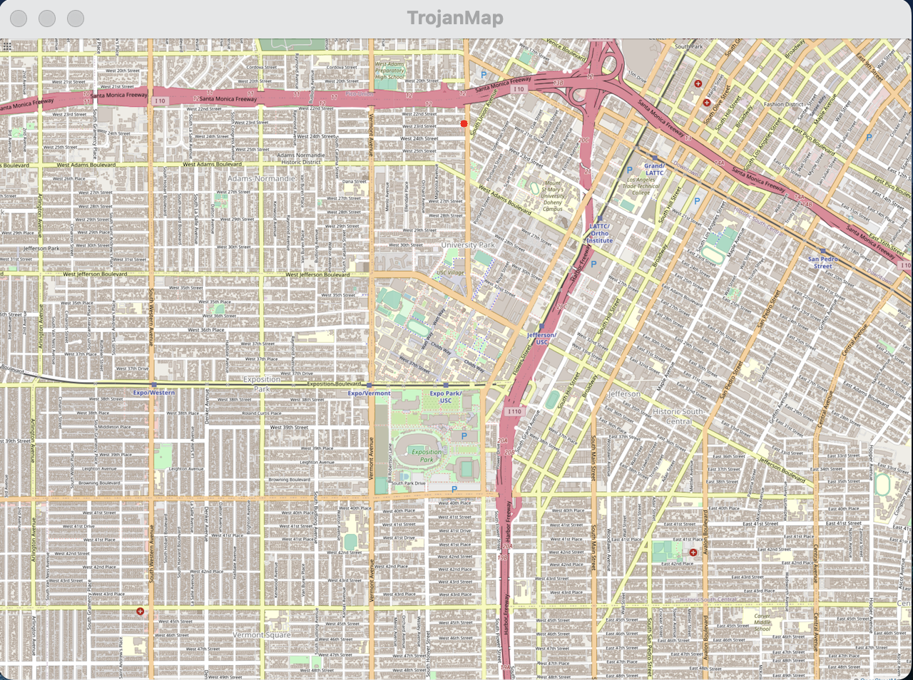
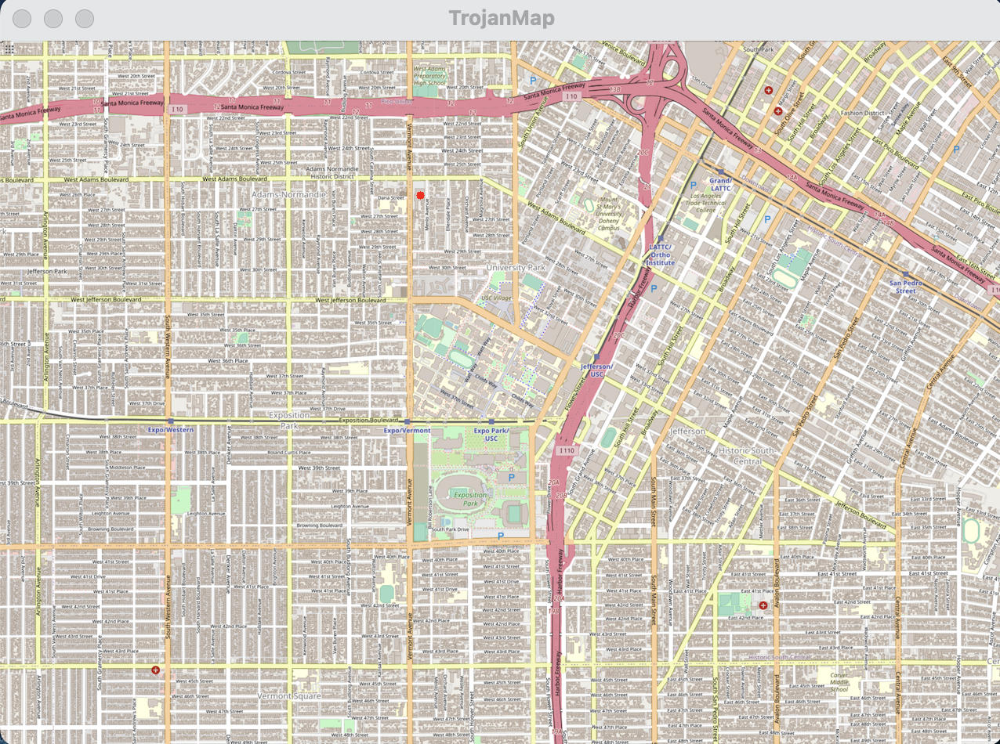

<center><h3>EE 538 - Computing Principles for Electrical Engineers</h3></center>

<center><h1>Trojan Map Report</h1></center>

<center><h4>Team Member: Yuanji Qiu(USC ID:707421454)  Weiqiang Qian(USC ID:5555112745)</h4></center>

<h3>Content</h3>
1.Autocomplete the location name
2.Find the place's Coordinates in the map
3.Calculate shortest path between two places
4.The traveling Trojan problem(AKA Traveling Salesman!)
5.Cycle Detection
6.Topological sort
7.Find Nearby
8.Summary


## Document Symbol Dercription

| Symbol | Description        |
| :----: | ------------------ |
|   ®️    | Reference variable |
|   🟢    | Input parameters   |
|   🔴    | Output parameters  |
|   🔒    | Read-only variable |


## Data Structure 


Each point on the map is represented by the class **Node** shown below and defined in trojanmap.h

```c++
class Node {
public:
    Node(){};
    Node(const Node &n){id = n.id; lat = n.lat; lon = n.lon; name = n.name; neighbors = n.neighbors; attributes = n.attributes;};
    std::string id;                              // A unique id assign to each point
    double lat;                                  // Latitude
    double lon;                                  // Longitude
    std::string name;                            // Name of the location. E.g. "Bank of America".
    std::vector<std::string> neighbors;          // List of the ids of all neighbor points.
    std::unordered_set<std::string> attributes;  // List of the attributes of the location.
};
```

​	Also, in order to realise these functions conveniently, we created our own namespace rhqwq and some data structures in trojanmap.h

```c++
// Self-defined implimentation
namespace rhqwq{
// Data Structure
typedef std::pair<std::string, Node*>   NameNode_t;     // A pair binding the location name with its node information.
typedef std::vector< NameNode_t >       V_NameNode_t;   // A vector contains a bunch of such combinations.
typedef std::string NodeId_t;
class BellmanInfo_t{
public:
    NodeId_t  id;
    NodeId_t  prev_id;
    Node     *node;
    double   distance;
    BellmanInfo_t(){}
    BellmanInfo_t( NodeId_t node_id, double dis, Node* node) :id(node_id),node(node),distance(dis){};
    
};
class DijkstraInfo_t : public BellmanInfo_t{
public:
    bool      visited;
    DijkstraInfo_t(){}
    DijkstraInfo_t( NodeId_t node_id, double dis, Node* node ) :visited(false), BellmanInfo_t(node_id,dis,node) {}
        
};

```


### `rhqwq::DijkstraInfo_t` 	

| Member     | Type       | Initialization Value | Description                                       |
| ---------- | :--------- | -------------------- | ------------------------------------------------- |
| `id`       | `NodeId_t` | `data(id)`           | Represent the current node’s id                   |
| `prev_id`  | `NodeId_t` | `data(id)`           | Represent the previous node’s id                  |
| `*node`    | `Node`     | `nullptr`            | Pointer the content(lat,lon,id) in the class Node |
| `visited`  | `bool`     | `false`              | To record the nodes that were been visited        |
| `distance` | `double`   | `INFINITY`           | To record the distance between the nodes          |


## Auxiliary Function Method

### `rhqwq::tolowercase_`

| Params     | Attributes | Type                  | Description                                |
| ---------- | :--------: | --------------------- | ------------------------------------------ |
| `str`      | 🟢 \| 🔒\|®️  | `const std::string &` | The input string to be converted           |
| `$return$` |     🔴      | `std::string`         | The lower case version of the input string |


### `rhqwq::binary_search_`

| Params     | Attributes |               Type               | Description                        |
| ---------- | :--------: | :------------------------------: | :--------------------------------- |
| `list`     |  🟢 \|🔒\|®️  | `const vector<std::pair<T,N> >&` | Define a pair to store two strings |
| `tar`      |  🟢 \|🔒\|®️  |            `const T&`            | The input string that we type      |
| `$return$` |     🔴      |       `std::pair<bool,id>`       | The input(if exists), otherwise -1 |


### `rhqwq::strip_`

| Params | Attributes | Type                                   | Description                  |
| :----- | :--------: | -------------------------------------- | ---------------------------- |
| `str`  |  🟢 \|🔒\|®️  | `static void strip_(std::string& str)` | Strip the space in the input |


We also do some pre-processing on our dataset in trojanmap.cc  to make it faster when we use this app.

```c++
namespace rhqwq{
static std::string tolowercase_(const std::string &str){
    std::string tmp = str;
    transform(tmp.begin(), tmp.end(), tmp.begin(), ::tolower);
    return tmp;
}

template<class T, class N>
static std::pair<bool,size_t> binary_search_(const vector<std::pair<T,N> >& list, const T& tar ){
    if( list.empty() ) return std::make_pair( false, -1 );

    int l=0, r=(int)(list.size()-1);
    auto m = ((l+r)>>1);
    while( l<=r ){
        m = ((l+r)>>1);
        if( list[m].first == tar ){
            return std::make_pair( true, m );
        }else if( list[m].first > tar ){
            r = m-1;
        }else{
            l = m+1;
        }
    }

    return std::make_pair( false, m );
}

static void strip_(std::string& str){
    if (str.length() == 0) return;

    auto start_it = str.begin();
    auto end_it   = str.rbegin();
    while (std::isspace(*start_it)) {
        ++start_it;
        if (start_it == str.end()) break;
    }
    while (std::isspace(*end_it)) {
        ++end_it;
        if (end_it == str.rend()) break;
    }
    auto start_pos = start_it - str.begin();
    auto end_pos   = end_it.base() - str.begin();
    str = (start_pos <= end_pos) ? std::string(start_it, end_it.base()) : "";
}
}
```


<h3>1.Autocomplete the location name</h3>

<h4>1.1 Function</h4>

```c++
std::vector<std::string> TrojanMap::Autocomplete(std::string name);
```

​	Type the partial name of the location and return a list of possible locations with partial name as prefix. It's also not a case-sensitive function, so we just turn all of the name to the lowercase.
It will take a long time if we just search a name in an unordered dataset. So we decided to sorted the dataset when we load the app. And use binary search to decrease the time comlexity to O(log(n)).

<h4>1.2 Results</h4>

```c++
**************************************************************
Please input a partial location:chi
*************************Results******************************
Chick-fil-A
Chinese Street Food
Chipotle
**************************************************************
Time taken by function: 0 ms
```

​	Because we sorted the data during the loading time. so it’s very fast to get the result(0ms) when we use this function. Also when I type the lowercase string it still return the original name in the dataset.
​	The time complexity of this function is:

<h3>2.Find the place’s Coordianes in the Map </h3>

<h4>2.1 Function</h4>

```c++
std::pair<double, double> TrojanMap::GetPosition(std::string name); 
```

It’s similar to the previous function, we sort the dataset firstly and use binary search to compare the name with the input.

Also we need to give the most similar word if we have a typo in our input , so we implement these two functions.

```c++
int TrojanMap::CalculateEditDistance(std::string w1, std::string w2);
std::string TrojanMap::FindClosestName(std::string name);
```

​	First we use dynamic programming on the EditDistance, and do it twice by taking pointer and vector. Then we decided to take the fastest method——iteration. Then we find the closest name by taking rules of the smallest edit distance. (It’s case sensitive)

 	The status transition equation is this:

```c++
 if word1[i]==word2[j]:
	d[i][j]=1+min(d[i-1][j],d[i][j-1],d[i-1][j-1]-1)
 if word1[i]!=word2[j]:
	d[i][j]=1+min(d[i-1][j],d[i][j-1],d[i-1][j-1]-1)
```

<h4>2.2 Results</h4>

```c++
**************************************************************
* 2. Find the location                                        
**************************************************************

Please input a location:arco
*************************Results******************************
No matched locations.
Did you mean Arco instead of arco? [y/n]y
Latitude: 34.0354 Longitude: -118.284
**************************************************************
Time taken by function: 0 ms
```



```c++
**************************************************************
Please select 1 - 8: 2

**************************************************************
* 2. Find the location                                        
**************************************************************

Please input a location:Ralphs
*************************Results******************************
Latitude: 34.0318 Longitude: -118.291
**************************************************************
Time taken by function: 0 ms
```



​	From the results we can see the run time is pretty fast(0ms)
​	The time complexity of GetPosition is O(log(n));
​	The time complexity of CalculateEditDistance is O(n²);

<h3>3.Calculate shortest path between two places</h3>

<h4>3.1 Function</h4>

```c++
std::vector<std::string> CalculateShortestPath_Dijkstra(std::string &location1_name,
                                               std::string &location2_name);
std::vector<std::string> CalculateShortestPath_Bellman_Ford(std::string &location1_name,
                                               std::string &location2_name);
```

For Bellman_Ford, the flowchart explains how it works:


There is a optinization during loading a node,We can start our search from the one that being updated during the last iteration. We use queue to record that.

For Dijkstra, the flowchart explains how it works:


<h4>3.2 Results</h4>

Start location: ‘Los Angeles & Olympic’

Destination: ‘Vermont Elementary School’

<h5>Bellman_Ford</h5>


<h5>Dijkstra</h5>


The route is just the same as the Google map!

<h5>Comparison</h5>

Time spend for 1 route


Time spend for 10 routes


Dijkstra alwasy has a better performance than Bellman Ford.

​	The time complexity of Bellman ford is O((V+E)log(V)).

​	The time complexity of Dijkstra is O(VE).

<h3>4.Traveling Sales Man</h3>

<h4>4.1 Function</h4>

```c++
std::pair<double, std::vector<std::vector<std::string>>> TravellingTrojan_Brute_force(
      std::vector<std::string> location_ids);
std::pair<double, std::vector<std::vector<std::string>>> TravellingTrojan_Backtracking(
      std::vector<std::string> location_ids);
std::pair<double, std::vector<std::vector<std::string>>> TravellingTrojan_2opt(
      std::vector<std::string> location_ids);
```

For Brute force, here is the flowchart:


2-OPT is similar to the Brute force, however there is no permutation in this algorithm, but two for-loops to calculate the shortest path in a limited condition, so the results may not be the shortest distance.

For backtracking, we make some optimizations on it, we create our permutation template, here is the instruction:

•When not reach the end, move the pivot (aka. cs ) to the next. 

•Swap the element you choose with the pivot one.

•When reach the end, do something

​	Calculate distance are very costing since it use a lot of floating number computation. Our goal is to avoid duplicated computation. 
​	First, we memorize all the possible distance calculation by creating table to record that. The time complexity is O(n^2). But we only need to make a strictly up triangular matrix. 
​	Second, memorize the distance of the previous path so that we don’t need to calculate it from the vary beginning. 
​	Third, stop early. When we found that current path has already exceed the minimum one that recorded, stop.

Here is the idea that we calculate the distance, cross symbol is the element we will assign directly(because distance from A->B is equal to B->A, only need to calculate once).


<h4>4.2 Results</h4>

| Method\Nodes\Distance | 8\ms | D\miles | 9\ms | D\miles | 10\ms | D\miles | 11\ms | D\miles | 12\ms | D\miles | 13\ms   | D\miles | 14\ms   | D\miles | 15\ms   | D\miles | 20\ms   | D\miles |
| --------------------- | ---- | ------- | ---- | ------- | ----- | ------- | ----- | ------- | ----- | ------- | ------- | ------- | ------- | ------- | ------- | ------- | ------- | ------- |
| Brute Force           | 17   | 9.35036 | 281  | 10.9525 | 2700  | 8.36814 | 35706 | 11.1948 | 85734 | 11.8797 | Unknown | Unknown | Unknown | Unknown | Unknown | Unknown | Unknown | Unknown |
| Backtracking          | 0    | 9.35036 | 2    | 10.9525 | 10    | 8.36814 | 102   | 11.1948 | 272   | 11.8797 | 9724    | 11.4554 | 9724    | 9.67194 | 23723   | 12.0943 | Unknown | Unknown |
| 2-OPT                 | 1    | 9.36361 | 0    | 10.9525 | 1     | 8.36814 | 2     | 11.2853 | 2     | 12.4787 | 8       | 11.4454 | 9       | 9.67564 | 12      | 12.5366 | 42      | 15.0258 |


Here is the three algorithm results, we record several times test results and plot it , in small number of nodes, backtracking and 2-opt performs better than brute force, but as the number of nodes getting larger, 2-opt stays the performance, but the rest will take tremendous time to get result, the second we use log function to process the data.

​	The time complexity of Brute force is O(n!).
​	The time complexity of Backtracking is O(n!) but better than bruteforce.
​	The time complexity of 2-OPT is (n²+MAX_COUNT).

<h3>5. Cycle Detection</h3>

<h4>5.1 Function</h4>

```c++
bool CycleDetection(std::vector<double> &square);
```

​	we use DFS to traverse all the nodes and return true if there is a back edges. The time complexity is O(N), here is the results for this function, as you can see, green line is the edge for the neighbors, the first figure doesn’t have a connected green line and the second does have a connected circle, so that’s what this function do.

<h4>5.2 Results</h4>


Green line is the edge for the neighbors, the first figure doesn’t have a connected green line and the second does have a connected circle.

The time complexity of CycleDetection is O(n).

<h3>6. Topological Sort</h3>

<h4>6.1 Function</h4>

```c++
std::vector<std::string> DeliveringTrojan(std::vector<std::string> &location_names,
                                            std::vector<std::vector<std::string>> &dependencies);
```

The flowchart show how it works:


<h4>6.2 Results</h4>

Here is the nodes information and dependencies.


Here is the other results that these nodes has a dependency loop.(No topological Sort).


The time coimplexity of TopologicalSort is O(VE).

<h3>7. FindNearby</h3>

<h4>7.1 Function</h4>

```c++
std::vector<std::string> TrojanMap::FindNearby(std::string attributesName, std::string name, double r, int k);
```

When encountering a new node that has such attribute, we use binary search to find a right position to insert it to our container. Then, the k-th elements in this container are the answer. Here is the flowchart:


<h4>7.2 Result</h4>


Green point is the center, red points are the results that satisfy our requirement.

<h3>8. Summary</h3>

​	In this final project, While completing the basic functions, we mainly focus on speeding up the program. Fortunately, during the presentation, we found that our running speed performs better than most of students in this class.

​	In the improvement of the code, we analyzed the tolerance of users in using the app. We believed that most users were more tolerant of the former in the process of loading and using the app, so we sacrificed the loading time of the program in exchange for the fast running of the function

​	But we still have some functions that are not implemented due to time constraints ——3-opt and dynamic, animated UI. 

​	This project gave us a good opportunity in writing C++ codes, and give us a deeper understanding of algorithms, which is very helpful for our career.


⭕️⛔️🟩🟥❌✅🔴🟢🔘☑️🔒🔓🔗®️

