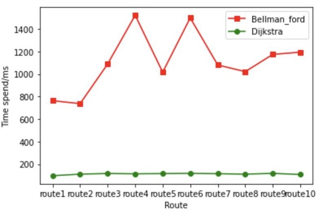

<center><h3>EE 538 - Computing Principles for Electrical Engineers</h3></center>

<center><h1>Trojan Map Report</h1></center>

<center><h3>Team Member: Yuanji Qiu(USC ID:707421454)  Weiqiang Qian(USC ID:5555112745)</h3></center>

<h3>Content</h3>
1.Autocomplete the location name
2.Find the place's Coordinates in the map
3.Calculate shortest path between two places
4.The traveling Trojan problem(AKA Traveling Salesman!)
5.Cycle Detection
6.Topological sort
7.Find Nearby
8.Summary


## Member Functions & Variables

### Phase 1

| Name                               | Description                                           |
| ---------------------------------- | ----------------------------------------------------- |
| [.Autocomplete](#autocomplete)     | Complete the location name given a half-word          |
| [.GetLat](#getlat])                | Get the latitude of a location                        |
| [.GetLon](#getlon])                | Get the longtitude of a location                      |
| [.GetName](#getname)               | Get the name of a location                            |
| [.GetID](#getid)                   | Get the unique identification of a location           |
| [.GetNeighborIDs](#getneighborids) | Get neighbors of a location                           |
| [.GetPosition](#getposition)                     |                                                       |
| [.CalculateEditDistance](#calculateeditdistance)           | Calculate a the shortest edit distance of two strings |
| [.FindClosestName](findclosestname)          | Find out the cloest name matched with the given one   |

[TEST Phase1](#test_phase1)


### Phase 2

| Name                                                  | Description |
| -------------------------------------                 | ----------- |
| [.CalculateShortestPath_Bellman_Ford](#bellman)       |             |
| [.CalculateShortestPath_Dijkstra](#dijkstra)          |             |
| [.CycleDetection](#cycledetection)                    |             |
| [.DeliveringTrojan](#topo)                            |             |
|                                                       |             |


## Detailed Implimentation

---

<h3>Autocomplete</h3> <div id="autocomplete"></div>

```c++
std::vector<std::string> TrojanMap::Autocomplete(std::string name);
```

Type the partial name of the location and return a list of possible locations with partial name as prefix. It's also not a case-sensitive function, so we just turn all of the name to the lowercase.


It will take a long time if we just search a name in an unordered dataset. So we decided to sorted the dataset when we load the app. And use binary search to decrease the time comlexity to `O(log(n))`.


We pre-sort the name list of all the nodes in the order of string. When given a name, we add a letter `z` and space because the name appear only in this range. Then we use **binary search** to find out the range between these two.

- **Time complexity**

  `O(log n)`


- **Example**

  [input]

  ```c++
  auto v = tmap.Autocomplete("chi");
  ```

   

  [output]

  ```
  **************************************************************
  Please input a partial location:chi
  *************************Results******************************
  Chick-fil-A
  Chinese Street Food
  Chipotle
  **************************************************************
  Time taken by function: 0 ms
  ```


---

<h3>GetLat</h3> <div id="getlat"></div>

```c++
double GetLat(const std::string& id);
```

We already have the mapping from id to its node information. It's easy.

---

<h3>GetLon</h3> <div id="getlon"></div>

```c++
double GetLon(const std::string& id);
```

---

<h3>GetName</h3> <div id="getname"></div>

```c++
std::string GetName(const std::string& id);
```

---

<h3>GetID</h3> <div id="getid"></div>

```c++
std::string GetID(const std::string& name);
```

Use our **binary search** model to search a node entire information through its name.

- **Time Complexity**

  `O(log n)`

  

- **Example**

  [input]

  ```c++
  auto s = GetID("KFC");
  ```

  [output]

  ```
  3088547686
  ```


---

<h3>GetNeighborIDs</h3> <div id="getneighborids"></div>

```c++
std::vector<std::string> GetNeighborIDs(const std::string& id);
```


---


<h3>GetPosition</h3> <div id="getposition"></div>

```c++
std::pair<double, double> TrojanMap::GetPosition(std::string name); 
```

- **Time Complexity**

  `O(log n)`

---

<h3>CalculateEditDistance</h3> <div id="calculateeditdistance"></div>

```c++
int TrojanMap::CalculateEditDistance(std::string w1, std::string w2);
```

It’s similar to the previous function, we sort the dataset firstly and use binary search to compare the name with the input.

Also we need to give the most similar word if we have a typo in our input , so we implement these two functions.

Here is the dynamic programming table:


This table memorize what is the shortest edit distance so far. Since we update each step with its local optimal result. Therefore, we will eventually get the global optimal result which is the element at the right bottom corner.

- **Time Complexity**

  `O(mn)`  m and n is the string length respectively.

  

- **Example**

  [input]

  ```c++
  int n = tmap.CalculateEditDistance("USC", "UCLA");
  ```

  [output]

  ```
  3
  ```
  

---

<h3>FindClosestName</h3> <div id="findclosestname"></div>

We compare all the possible name with the given one and call the function `CalculateEditDistance` to get the minimum edit distance correspond with the nodes and return that name.

- **Time Complexity**

  `O(n)`

  

- **Example**

  [input]

  ```c++
  auto s = tmap.FindClosestName("Adem Fuet")
  ```

  [output]

  ```
  Adams Fuel
  ```

  

---

<h3>CalculateShortestPath_Bellman_Ford</h3> <div id="bellman"></div>

We impliment this function by the following flow chart.


We use `std::map` as our table data structure with these following properties.

1. Good searching method
2. Store distance information
3. Store node information


We initialize the table by setting all the other nodes to `INFINITY`.


Here we summarize the key point about relaxing a location node.

1. Calculate the distance to neighbor
2. Add current node distance away from root
3. Compare to the neighbor distance, if shorter, update the table

For further detail of relaxing a node, please see [rhqwq::relax_](#rhqwqrelax)

For the data structure of our bellman table, please see [rhqwq::Bellman_Info_t](#rhqwqbellman)


**Optimization:**

1. No need to iterate all the node

2. Stop when no other distance updated

3. Starting from the node that previously updated


Use queue to store the node that just being updated. When update a node, put it into the queue. When iterate a node, pop one from the queue. The queue always store the data that is updated from the previous iteration. When the queue is empty, we stop. Because no additional node is updated.


- **Time Complexity**

  `O(VE)` V and E are the numbers of vertices and edges.

   

- **Example**

  [input] QWQ

  ```c++
  ```

  [output]

  ```
  ```

  


---

<h3>CalculateShortestPath_Dijkstra</h3> <div id="dijkstra"></div>

We impliment this function by the following flow chart.


Use `std::priority_queue` to find out the unvisited node with shortest distance.

We create a boolean flag to mark visited node.


- **Time Complexity**

  `O( (V+E)log(V+E) )`


- **Example**

  [input]

  ```c++
  auto v = tmap.CalculateShortestPath_Dijkstra("Los Angeles & Olympic", "Vermont Elementary School");
  ```

  [output]

  ```
  5002237122 2820043671 3659488053 2871010078 ... 6818427893 6818427894 6818427895 6807909277 358794109 
  ```


- **Comparison**

  Here is the comparison for 10 rounds for searching a shortest path between `Bellman` and `Dijsktra` algorithm.

  

   

  Here is the comparison for 10 routes for searching a shortest path between `Bellman` and `Dijsktra` algorithm.

  

---

<h3>CycleDetection</h3> <div id="cycledetection"></div>

Check the existence for a cycle path in a subgraph. Use DFS to traverse all the nodes and return true if a neighbour has been visited twice (except parents) 

- **Time Complexity**

  `O(n)`

  

- **Example**

  [input]

  ```bash
  $ -118.290
  $ -118.289
  $ 34.030
  $ 34.020
  ```

  [output]

  ```c++
  *************************Results******************************
  there exist no cycle in the subgraph 
  **************************************************************
  Time taken by function: 15 ms
  ```

   


- [input]

  ```bash
  $ -118.291
  $ -118.289
  $ 34.030
  $ 34.020
  ```

  [output]

  ```c++
  *************************Results******************************
  there exists a cycle in the subgraph 
  **************************************************************
  Time taken by function: 19 ms
  ```

   


---

<h3>DeliveringTrojan</h3> <div id="topo"></div>

We impliment this function by the following flow chart.


Use Breath First Search to iterate the graph nodes.

**Optimization**

1. Push the node into queue while doing the process

2. Reduce neighbor’s income is the only fact cause it to zero.


- **Time Complexity**

  `O(VE)`

   

- **Example**

  [input]

   

  [output]

   


## Self-Defined Method & Member

<h3>rhqwq::relax_</h3> <div id="rhqwqrelax"></div>


<h3>rhqwq::Bellman_Info_t</h3> <div id="rhqwqbellman"></div>

| Member     | Type       | Initialization Value | Description                                       |
| ---------- | :--------- | -------------------- | ------------------------------------------------- |
| `id`       | `NodeId_t` | `data(id)`           | Represent the current node’s id                   |
| `prev_id`  | `NodeId_t` | `data(id)`           | Represent the previous node’s id                  |
| `*node`    | `Node`     | `nullptr`            | Pointer the content(lat,lon,id) in the class Node |
| `distance` | `double`   | `INFINITY`           | To record the distance between the nodes          |


## Test Validation

<h3>Test - Phase 1</h3> <div id="test_phase1"></div>

- **Case 1**

  [input]

  ```bash
  $ 2
  $ pico
  $ y
  ```

  [output]

  

  

- **Case 2**

  [input]

  ```bash
  $ 2
  $ rophs
  $ y
  ```

  [output]

  

- **Case 3**

  [input]

  ```bash
  $ 2
  $ 11
  $ y
  ```

  [output]

  


- **Case 4**

  [input]

  ```bash
  $ 1
  $ Ta
  ```

  [output]

  ```c++
  *************************Results*****************************
  Tap Two Blue
  Target
  *************************************************************
  Time taken by function: 0 ms
  ```

  


<h3>3.Calculate shortest path between two places</h3>

<h3>3.1 Function</h3>

```c++
std::vector<std::string> CalculateShortestPath_Dijkstra(std::string &location1_name,
                                               std::string &location2_name);
std::vector<std::string> CalculateShortestPath_Bellman_Ford(std::string &location1_name,
                                               std::string &location2_name);
```

For Bellman_Ford, the flowchart explains how it works:


There is a optinization during loading a node,We can start our search from the one that being updated during the last iteration. We use queue to record that.

For Dijkstra, the flowchart explains how it works:


<h3>3.2 Results</h3>

Start location: ‘Los Angeles & Olympic’

Destination: ‘Vermont Elementary School’

<h5>Bellman_Ford</h5>


<h5>Dijkstra</h5>


The route is just the same as the Google map!

<h5>Comparison</h5>

Time spend for 1 route


Time spend for 10 routes


Dijkstra alwasy has a better performance than Bellman Ford.

​	The time complexity of Bellman ford is O((V+E)log(V)).

​	The time complexity of Dijkstra is O(VE).

<h3>4.Traveling Sales Man</h3>

<h3>4.1 Function</h3>

```c++
std::pair<double, std::vector<std::vector<std::string>>> TravellingTrojan_Brute_force(
      std::vector<std::string> location_ids);
std::pair<double, std::vector<std::vector<std::string>>> TravellingTrojan_Backtracking(
      std::vector<std::string> location_ids);
std::pair<double, std::vector<std::vector<std::string>>> TravellingTrojan_2opt(
      std::vector<std::string> location_ids);
```

For Brute force, here is the flowchart:


2-OPT is similar to the Brute force, however there is no permutation in this algorithm, but two for-loops to calculate the shortest path in a limited condition, so the results may not be the shortest distance.

For backtracking, we make some optimizations on it, we create our permutation template, here is the instruction:

•When not reach the end, move the pivot (aka. cs ) to the next. 

•Swap the element you choose with the pivot one.

•When reach the end, do something

​	Calculate distance are very costing since it use a lot of floating number computation. Our goal is to avoid duplicated computation. 
​	First, we memorize all the possible distance calculation by creating table to record that. The time complexity is O(n^2). But we only need to make a strictly up triangular matrix. 
​	Second, memorize the distance of the previous path so that we don’t need to calculate it from the vary beginning. 
​	Third, stop early. When we found that current path has already exceed the minimum one that recorded, stop.

Here is the idea that we calculate the distance, cross symbol is the element we will assign directly(because distance from A->B is equal to B->A, only need to calculate once).


<h3>4.2 Results</h3>

| Method\Nodes\Distance | 8\ms | D\miles | 9\ms | D\miles | 10\ms | D\miles | 11\ms | D\miles | 12\ms | D\miles | 13\ms   | D\miles | 14\ms   | D\miles | 15\ms   | D\miles | 20\ms   | D\miles |
| --------------------- | ---- | ------- | ---- | ------- | ----- | ------- | ----- | ------- | ----- | ------- | ------- | ------- | ------- | ------- | ------- | ------- | ------- | ------- |
| Brute Force           | 17   | 9.35036 | 281  | 10.9525 | 2700  | 8.36814 | 35706 | 11.1948 | 85734 | 11.8797 | Unknown | Unknown | Unknown | Unknown | Unknown | Unknown | Unknown | Unknown |
| Backtracking          | 0    | 9.35036 | 2    | 10.9525 | 10    | 8.36814 | 102   | 11.1948 | 272   | 11.8797 | 9724    | 11.4554 | 9724    | 9.67194 | 23723   | 12.0943 | Unknown | Unknown |
| 2-OPT                 | 1    | 9.36361 | 0    | 10.9525 | 1     | 8.36814 | 2     | 11.2853 | 2     | 12.4787 | 8       | 11.4454 | 9       | 9.67564 | 12      | 12.5366 | 42      | 15.0258 |


Here is the three algorithm results, we record several times test results and plot it , in small number of nodes, backtracking and 2-opt performs better than brute force, but as the number of nodes getting larger, 2-opt stays the performance, but the rest will take tremendous time to get result, the second we use log function to process the data.

​	The time complexity of Brute force is O(n!).
​	The time complexity of Backtracking is O(n!) but better than bruteforce.
​	The time complexity of 2-OPT is (n²+MAX_COUNT).

<h3>5. Cycle Detection</h3>

<h3>5.1 Function</h3>

```c++
bool CycleDetection(std::vector<double> &square);
```

​	we use DFS to traverse all the nodes and return true if there is a back edges. The time complexity is O(N), here is the results for this function, as you can see, green line is the edge for the neighbors, the first figure doesn’t have a connected green line and the second does have a connected circle, so that’s what this function do.

<h3>5.2 Results</h3>


Green line is the edge for the neighbors, the first figure doesn’t have a connected green line and the second does have a connected circle.

The time complexity of CycleDetection is O(n).

<h3>6. Topological Sort</h3>

<h3>6.1 Function</h3>

```c++
std::vector<std::string> DeliveringTrojan(std::vector<std::string> &location_names,
                                            std::vector<std::vector<std::string>> &dependencies);
```

The flowchart show how it works:


<h3>6.2 Results</h3>

Here is the nodes information and dependencies.


Here is the other results that these nodes has a dependency loop.(No topological Sort).


The time coimplexity of TopologicalSort is O(VE).

<h3>7. FindNearby</h3>

<h3>7.1 Function</h3>

```c++
std::vector<std::string> TrojanMap::FindNearby(std::string attributesName, std::string name, double r, int k);
```

When encountering a new node that has such attribute, we use binary search to find a right position to insert it to our container. Then, the k-th elements in this container are the answer. Here is the flowchart:


<h3>7.2 Result</h3>


Green point is the center, red points are the results that satisfy our requirement.

<h3>8. Summary</h3>

​	In this final project, While completing the basic functions, we mainly focus on speeding up the program. Fortunately, during the presentation, we found that our running speed performs better than most of students in this class.

​	In the improvement of the code, we analyzed the tolerance of users in using the app. We believed that most users were more tolerant of the former in the process of loading and using the app, so we sacrificed the loading time of the program in exchange for the fast running of the function

​	But we still have some functions that are not implemented due to time constraints ——3-opt and dynamic, animated UI. 

​	This project gave us a good opportunity in writing C++ codes, and give us a deeper understanding of algorithms, which is very helpful for our career.


⭕️⛔️🟩🟥❌✅🔴🟢🔘☑️🔒🔓🔗®️

