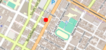

<center><h3>EE 538 - Computing Principles for Electrical Engineers</h3></center>

<center><h1>Trojan Map Report</h1></center>

<center><h3>Team Member: Yuanji Qiu(USC ID:707421454)  Weiqiang Qian(USC ID:5555112745)</h3></center>

<h3>Content</h3>
1.Autocomplete the location name
2.Find the place's Coordinates in the map
3.Calculate shortest path between two places
4.The traveling Trojan problem(AKA Traveling Salesman!)
5.Cycle Detection
6.Topological sort
7.Find Nearby
8.Summary


## Member Functions & Variables

| Name                                             | Description                                                  |
| ------------------------------------------------ | ------------------------------------------------------------ |
| **Phase 1**                                      |                                                              |
| [.Autocomplete](#autocomplete)                   | Complete the location name given a half-word                 |
| [.GetLat](#getlat])                              | Return the latitude of a location                            |
| [.GetLon](#getlon])                              | Return the longtitude of a location                          |
| [.GetName](#getname)                             | Return the name of a location                                |
| [.GetID](#getid)                                 | Return the unique identification of a location               |
| [.GetNeighborIDs](#getneighborids)               | Return neighbors of a location                               |
| [.GetPosition](#getposition)                     | Return the coordinate of a location                          |
| [.CalculateEditDistance](#calculateeditdistance) | Calculate a the shortest edit distance of two strings        |
| [.FindClosestName](#findclosestname)             | Find out the cloest name matched with the given one          |
| **Phase 2**                                      |                                                              |
| [.CalculateShortestPath_Bellman_Ford](#bellman)  | Given two location, return its shortest path using bellman algorithm |
| [.CalculateShortestPath_Dijkstra](#dijkstra)     | Given two location, return its shortest path using dijkstra  algorithm |
| [.CycleDetection](#cycledetection)               | Check whether there exists a loop edges in a set of nodes and edges |
| [.DeliveringTrojan](#topo)                       | Sort the nodes in the order of topological                   |
| **Phase 3**                                      |                                                              |
| [.TravellingTrojan_Brute_force](#bruteforce)     | Given a set of nodes, return the solution for TSP problems   |
| [.TravellingTrojan_Backtracking](#backtracking)  | Given a set of nodes, return the solution for TSP problems optimized by DP and BT |
| [.TravellingTrojan_2opt](#2opt)                  | Return a heuristic solution for TSP problems                 |
| [.FindNearby](#findnearby)                       | Given a radius and search the location nearby                |

[TEST Phase1](#test_phase1) | [TEST_Phase2](#test_phase2) | [TEST_Phase3](#test_phase3)


## Detailed Implimentation

---

<h3>Autocomplete</h3> <div id="autocomplete"></div>

```c++
std::vector<std::string> TrojanMap::Autocomplete(std::string name);
```

Type the partial name of the location and return a list of possible locations with partial name as prefix. It's also not a case-sensitive function, so we just turn all of the name to the lowercase.


It will take a long time if we just search a name in an unordered dataset. So we decided to sorted the dataset when we load the app. And use binary search to decrease the time comlexity to `O(log(n))`.


We pre-sort the name list of all the nodes in the order of string. When given a name, we add a letter `z` and space because the name appear only in this range. Then we use **binary search** to find out the range between these two.

For the further detail of our binary search function, please see [Binary Search](#binarysearch).

- **Time complexity**

  `O(log n)` | `0ms`


- **Example**

  [input]

  ```c++
  auto v = tmap.Autocomplete("chi");
  ```

   

  [output]

  ```
  **************************************************************
  Please input a partial location:chi
  *************************Results******************************
  Chick-fil-A
  Chinese Street Food
  Chipotle
  **************************************************************
  Time taken by function: 0 ms
  ```


---

<h3>GetLat</h3> <div id="getlat"></div>

```c++
double GetLat(const std::string& id);
```

We already have the mapping from id to its node information. It's easy.

- **Time Complexity**

  `O(1)~O(log n)` | `0ms`

  

---

<h3>GetLon</h3> <div id="getlon"></div>

```c++
double GetLon(const std::string& id);
```

**Time Complexity**

`O(1)~O(log n)` | `0ms`


---

<h3>GetName</h3> <div id="getname"></div>

```c++
std::string GetName(const std::string& id);
```

- **Time Complexity**

  `O(1)~O(log n)` | `0ms`


---

<h3>GetID</h3> <div id="getid"></div>

```c++
std::string GetID(const std::string& name);
```

Use our **binary search** model to search a node entire information through its name.

- **Time Complexity**

  `O(log n)` | `0ms`

  

- **Example**

  [input]

  ```c++
  auto s = GetID("KFC");
  ```

  [output]

  ```
  3088547686
  ```


---

<h3>GetNeighborIDs</h3> <div id="getneighborids"></div>

```c++
std::vector<std::string> GetNeighborIDs(const std::string& id);
```

- **Time Complexity**

  `O(1)~O(log n)` | `0ms` 


---

<h3>GetPosition</h3> <div id="getposition"></div>

```c++
std::pair<double, double> TrojanMap::GetPosition(std::string name); 
```

- **Time Complexity**

  `O(log n)` | `0ms`
  
  

---

<h3>CalculateEditDistance</h3> <div id="calculateeditdistance"></div>

```c++
int TrojanMap::CalculateEditDistance(std::string w1, std::string w2);
```

It’s similar to the previous function, we sort the dataset firstly and use binary search to compare the name with the input.

Also we need to give the most similar word if we have a typo in our input , so we implement these two functions.

Here is the dynamic programming table:


This table memorize what is the shortest edit distance so far. Since we update each step with its local optimal result. Therefore, we will eventually get the global optimal result which is the element at the right bottom corner.

- **Time Complexity**

  `O(mn)`  m and n is the string length respectively. | `0ms`

  

- **Example**

  [input]

  ```c++
  int n = tmap.CalculateEditDistance("USC", "UCLA");
  ```

  [output]

  ```
  3
  ```
  

---

<h3>FindClosestName</h3> <div id="findclosestname"></div>

We compare all the possible name with the given one and call the function `CalculateEditDistance` to get the minimum edit distance correspond with the nodes and return that name.

- **Time Complexity**

  `O(n)` | `0ms`

  

- **Example**

  [input]

  ```c++
  auto s = tmap.FindClosestName("Adem Fuet")
  ```

  [output]

  ```
  Adams Fuel
  ```

  

---

<h3>CalculateShortestPath_Bellman_Ford</h3> <div id="bellman"></div>

We impliment this function by the following flow chart.


We use `std::map` as our table data structure with these following properties.

1. Good searching method
2. Store distance information
3. Store node information


We initialize the table by setting all the other nodes to `INFINITY`.


Here we summarize the key point about relaxing a location node.

1. Calculate the distance to neighbor
2. Add current node distance away from root
3. Compare to the neighbor distance, if shorter, update the table

For further detail of relaxing a node, please see [rhqwq::relax_](#rhqwqrelax)

For the data structure of our bellman table, please see [rhqwq::Bellman_Info_t](#rhqwqbellman)


**Optimization:**

1. No need to iterate all the node

2. Stop when no other distance updated

3. Starting from the node that previously updated


Use queue to store the node that just being updated. When update a node, put it into the queue. When iterate a node, pop one from the queue. The queue always store the data that is updated from the previous iteration. When the queue is empty, we stop. Because no additional node is updated.


- **Time Complexity**

  `O(VE)` V and E are the numbers of vertices and edges. | `800ms`

   

- **Example**

  [input] 

  ```c++
  auto v = tmap.CalculateShortestPath_Bellman_Ford("Los Angeles & Olympic", "Vermont Elementary School");
  ```
  
  or using MapUI
  
  ```bash
  $ 3
  $ Los Angeles & Olympic
  $ Vermont Elementary School
  ```
  
  
  
  [output]
  
  ```
  5002237122 2820043671 3659488053 2871010078 
  ... 
  6818427893 6818427894 6818427895 6807909277 358794109 
  The distance of the path is:2.96658 miles
  **************************************************************
  Time taken by function: 861 ms
  ```
  
  


---

<h3>CalculateShortestPath_Dijkstra</h3> <div id="dijkstra"></div>

We impliment this function by the following flow chart.


Use `std::priority_queue` to find out the unvisited node with shortest distance.

We create a boolean flag to mark visited node.


- **Time Complexity**

  `O( (V+E)log(V+E) )`| `100ms`


- **Example**

  [input]

  ```c++
  auto v = tmap.CalculateShortestPath_Dijkstra("Los Angeles & Olympic", "Vermont Elementary School");
  ```

  [output]

  ```
  5002237122 2820043671 3659488053 2871010078 
  ... 
  6818427893 6818427894 6818427895 6807909277 358794109 
  The distance of the path is:2.96658 miles
  **************************************************************
  Time taken by function: 109 ms
  ```
  
   


- **Comparison**

  Here is the comparison for 10 rounds for searching a shortest path between `Bellman` and `Dijsktra` algorithm.

  

   

  Here is the comparison for 10 routes for searching a shortest path between `Bellman` and `Dijsktra` algorithm.

  


`Bellman` is almost 8 times slower then `Dijkstra` algorithm.


---

<h3><font face='courier'>CycleDetection</font></h3> <div id="cycledetection"></div>

Check the existence for a cycle path in a subgraph. Use DFS to traverse all the nodes and return true if a neighbour has been visited twice (except parents). 

- **Time Complexity**

  `O(n)`| `2ms`

  

- **Example**

  [input]

  ```bash
  $ -118.290
  $ -118.289
  $ 34.030
  $ 34.020
  ```

  [output]

  ```c++
  *************************Results******************************
  there exist no cycle in the subgraph 
  **************************************************************
  Time taken by function: 15 ms
  ```

   


- [input]

  ```bash
  $ -118.291
  $ -118.289
  $ 34.030
  $ 34.020
  ```

  [output]

  ```c++
  *************************Results******************************
  there exists a cycle in the subgraph 
  **************************************************************
  Time taken by function: 19 ms
  ```

   

There is a cycle appearing at the bottom.


---

<h3><font face='courier'>DeliveringTrojan</font></h3> <div id="topo"></div>

We impliment this function by the following flow chart.


Use Breath First Search to iterate the graph nodes.

**Optimization**

1. Push the node into queue while doing the process

2. Reduce neighbor’s income is the only fact cause it to zero.


- **Time Complexity**

  `O(VE)`| `0ms`

   

- **Example**

  [input]

   

  [output]

   


---

<h3><font face='courier'>TravellingTrojan_Brute_force</font></h3> <div id="bruteforce"></div>

```c++
std::pair<double, std::vector<std::vector<std::string>>> TravellingTrojan_Brute_force(
      std::vector<std::string> location_ids);
```

We impliment this function by the following flow chart.


This algorithm mainly is to permutate all the nodes and calculate the shortest distance. We use `std::next_permutation` to help as generate a permutation sequence.

- **Time Complexity**

  `O(n!)`| `40ms(8 nodes)`

 

- **Example**

  [input]

  ```c++
  Please input the number of the places:8
  "7864610982","6512300966","1855145665","7424270456","6818427895","4276259789","6814769287","1614922706"
  ```
  
  [output]
  
  ```
  *************************Results******************************
  TravellingTrojan_Brute_force
  "7864610982","6814769287","6818427895","4276259789","6512300966","1855145665","7424270456","1614922706","7864610982",
  The distance of the path is:7.28524 miles
  **************************************************************
  You could find your animation at src/lib/output0.avi.          
  Time taken by function: 30 ms
  
  ```


---

<h3><font face='courier'>TravellingTrojan_Backtracking</font></h3> <div id="backtracking"></div>

This is a optimized version of `Bruteforce` by using dynamic programming memorizing.

**Optimization 1**

We use distance table instead of calculate all the time.


It takes a lot of time doing float number computation. Here is the idea that we calculate the distance, cross symbol is the element we will assign directly(because distance from A->B is equal to B->A, only need to calculate once).


**Optimization 2**

We store the distance from the previous path, so we don't need to calculate from the vary beginning.


All you need to do is to add on current distance and see whether it exceeds the minimum one stored in our result table.

If not, continue the proceed, else abort the process and continue for the next permutation.


**Permutation**

For backtracking, we make some optimizations on it, we create our permutation template, here is the instruction:

1. When not reach the end, move the pivot (aka. cs ) to the next. 

2. Swap the element you choose with the pivot one.

3. When reach the end, do something

- [Demo Code]

  ```c++
  void helper( vector<int> &v, size_t cs, size_t ce, vector<vector<int>> &res){
      if( cs==ce ){                    // 首尾一致
          res.push_back(v);            // 计录结果
          return;
      }
      
      for( size_t i=cs; i<=ce; ++i ){  // 将 v[cs:ce]看成子数组,首项cs作为选中项
          std::swap( v[cs], v[i] );    // 挨个交换, 轮流做首项(选中项) 
          helper( v, cs+1, ce, res );  // 排除首项, 余下递归
          std::swap( v[cs], v[i] );    // 恢复进数组
      }
  }
  
  vector<vector<int>> permutate( vector<int> &v ){
      vector<vector<int>> res;
      helper( v, 0, v.size()-1, res );
      return res;
  }
  ```


- **Time Complexity**

  `O(n!)` - worst cases

  `O(n^2*2^n)`- general cases
  
   `0ms(8 nodes)`


- **Example**

  [input]

  ```c++
  Please input the number of the places:8
  "7864610982","6512300966","1855145665","7424270456","6818427895","4276259789","6814769287","1614922706"
  ```
  
  [output]
  
  ```
  *************************Results******************************
  TravellingTrojan_Backtracking
  "7864610982","1614922706","7424270456","1855145665","6512300966","4276259789","6818427895","6814769287","7864610982",
  The distance of the path is:7.28524 miles
  **************************************************************
  ```


 

---

<h3><font face='courier'>TravellingTrojan_2opt</font></h3> <div id="2opt"></div>

The result of this function might not be the optimal one, but reduce the chance to get the worest answer. We use two for loops to obtain sub part in a location and reverse 2 edges between 2 nodes if the distance is smaller than the previous one.

2-OPT is similar to the Brute force, however there is no permutation in this algorithm.

- **Time Complexity**

  `O(n^2 + MAX_COUNT)`| `0ms`

  

- **Example**

  [input]

  ```c++
  Please input the number of the places:8
  "7864610982","6512300966","1855145665","7424270456","6818427895","4276259789","6814769287","1614922706"
  ```
  
  [output]
  
  ```
  *************************Results******************************
  TravellingTrojan_2opt
  "7864610982","6814769287","6818427895","4276259789","6512300966","1855145665","7424270456","1614922706","7864610982",
  The distance of the path is:7.28524 miles
  **************************************************************
  You could find your animation at src/lib/output0_2opt.avi.     
  Time taken by function: 0 ms
  ```


- **Comparison**

  | Method/Nodes       | 8    | 9     | 10     | 11      | 12      | 13       | 14       | 15       | 20       |
  | ------------------ | ---- | ----- | ------ | ------- | ------- | -------- | -------- | -------- | -------- |
  | Brute Force        | 17ms | 281ms | 2700ms | 35706ms | 85734ms | $\infin$ | $\infin$ | $\infin$ | $\infin$ |
  | Back Tracking + DP | 0ms  | 2ms   | 10ms   | 102ms   | 272ms   | 9724ms   | 23723ms  | 73688ms  | $\infin$ |
  | 2-Opt              | 1ms  | 0ms   | 1ms    | 2ms     | 2ms     | 8ms      | 9ms      | 12ms     | 42ms     |

  

  | Method\Distance | 8       | 9       | 10      | 11      | 12      | 13      | 14      | 15      | 20      |
  | --------------- | ------- | ------- | ------- | ------- | ------- | ------- | ------- | ------- | ------- |
  | Brute Force     | 9.35036 | 10.9525 | 8.36814 | 11.1948 | 11.8797 | Unknown | Unknown | Unknown | Unknown |
  | Backtracking    | 9.35036 | 10.9525 | 8.36814 | 11.1948 | 11.8797 | 11.4554 | 9.67194 | 12.0943 | Unknown |
  | 2-OPT           | 9.36361 | 10.9525 | 8.36814 | 11.2853 | 12.4787 | 11.4454 | 9.67564 | 12.5366 | 15.0258 |
  
  As you can see `2-OPT` may not give the correct answer but it is super fast then the others.
  
  
  
  We plot the time diagram for 9 rounds and for the increasing number of nodes
  
   

The second graph was compressed by the log function.


---

<h3><font face='courier'>FindNearby</font></h3> <div id="findnearby"></div>

We impliment this function by the following flow chart.


We don't use any data structure, instead we use a vector that can grow up quickly by sorted order. Suppose we found a node that meets the requirement, we insert it into the vector using binary search to find out the correct position.

- **Time Complexity**

  `O(nlogn)`  - Assume the hashmap count as `O(1)`


- **Example**

  [input]

  ```c++
  Please input the attribute:supermarket
  Please input the locations:Chevron
  Please input radius r:5
  Please input number k:10
  ```

  [output]

  ```
  *************************Results******************************
  Find Nearby Results:
  1 Cal Mart Beer & Wine Food Store
  2 Trader Joes
  3 Ralphs
  4 Food 4 Less
  Time taken by function: 1 ms
  ```

  


## Self-Defined Method & Member

<h3>rhqwq::relax_</h3> <div id="rhqwqrelax"></div>

```c++
bool relax_( const rhqwq::BellmanInfo_t &info_current, rhqwq::BellmanInfo_t &info_neighbor );
```

Given a node and its neighbor, if it is necessary to relax its neighbor, return `true`, else return `false`.


<h3>rhqwq::tolowercase_</h3> <div id="tolowercase"></div>

```c++
static std::string tolowercase_(const std::string &str);
```

Given a string, return its version of lower case.


<h3>rhqwq::binary_search_</h3> <div id="binarysearch"></div>

```c++
template<class T, class N>
static std::pair<bool,size_t> binary_search_(const vector<std::pair<T,N> >& list, const T& tar );
```

Given a list and a target, return a pair. The first element indicates whether it was found. If so, then the second object is the exactly index. Otherwise, it tells you where should be inserted.


<h3>rhqwq::Bellman_Info_t</h3> <div id="rhqwqbellman"></div>

| Member     | Type       | Initialization Value | Description                                       |
| ---------- | :--------- | -------------------- | ------------------------------------------------- |
| `id`       | `NodeId_t` | `data(id)`           | Represent the current node’s id                   |
| `prev_id`  | `NodeId_t` | `data(id)`           | Represent the previous node’s id                  |
| `*node`    | `Node`     | `nullptr`            | Pointer the content(lat,lon,id) in the class Node |
| `distance` | `double`   | `INFINITY`           | To record the distance between the nodes          |


<h3>rhqwq::Dijkstra_Info_t</h3> <div id="rhqwqbellman"></div>

| Member             | Type   | Initialization Value | Description                           |
| ------------------ | ------ | -------------------- | ------------------------------------- |
| `visited`          | `bool` | `false`              | Indicate whether this node is visited |
| `$Bellman_Info_t$` |        |                      |                                       |


## Test Validation

<h3>Test - Phase 1</h3> <div id="test_phase1"></div>

- **Case 1**

  [input]

  ```bash
  $ 2
  $ pico
  $ y
  ```

  [output]

  

  

- **Case 2**

  [input]

  ```bash
  $ 2
  $ rophs
  $ y
  ```

  [output]

  

- **Case 3**

  [input]

  ```bash
  $ 2
  $ 11
  $ y
  ```

  [output]

  


- **Case 4**

  [input]

  ```bash
  $ 1
  $ Ta
  ```

  [output]

  ```c++
  *************************Results*****************************
  Tap Two Blue
  Target
  *************************************************************
  Time taken by function: 0 ms
  ```

  


<h3>Test - Phase 2</h3> <div id="test_phase2"></div>

- **Case 1**

  [input]

  ```
  $ Ralphs
  $ Target
  ```

  [output]

  ```
  *************************Dijkstra*****************************
  *************************Results******************************
  "2578244375","4380040154","4380040158","4380040167","6805802087","8410938469","6813416131","7645318201","6813416130","6813416129","123318563","452688940","6816193777","123408705","6816193774","452688933","452688931","123230412","6816193770","6787470576","4015442011","6816193692","6816193693","6816193694","4015377691","544693739","6816193696","6804883323","6807937309","6807937306","6816193698","4015377690","4015377689","122814447","6813416159","6813405266","4015372488","4015372487","6813405229","122719216","6813405232","4015372486","7071032399","4015372485","6813379479","6813379584","6814769289","5237417650",
  The distance of the path is:0.927969 miles
  **************************************************************
  Time taken by function: 121 ms
  
  *************************Bellman_Ford*************************
  *************************Results******************************
  "2578244375","4380040154","4380040158","4380040167","6805802087","8410938469","6813416131","7645318201","6813416130","6813416129","123318563","452688940","6816193777","123408705","6816193774","452688933","452688931","123230412","6816193770","6787470576","4015442011","6816193692","6816193693","6816193694","4015377691","544693739","6816193696","6804883323","6807937309","6807937306","6816193698","4015377690","4015377689","122814447","6813416159","6813405266","4015372488","4015372487","6813405229","122719216","6813405232","4015372486","7071032399","4015372485","6813379479","6813379584","6814769289","5237417650",
  The distance of the path is:0.927969 miles
  **************************************************************
  Time taken by function: 745 ms
  ```

  

- **Case 2**

  [input]

  ```
  -118.299
  -118.264
  34.032
  34.011
  ```

  [output]

  ```
  *************************Results******************************
  there exists a cycle in the subgraph 
  **************************************************************
  Time taken by function: 9 ms
  ```

  

- **Case 3**

  [input]

  ```
  -118.290
  -118.289
  34.032
  34.011
  ```

  [output]

  ```
  *************************Results******************************
  there exist no cycle in the subgraph 
  **************************************************************
  Time taken by function: 18 ms
  ```

  

- **Case 4**

  [input]

  
  
  [output]

  ```
  Please input the locations filename:./input/topologicalsort_locations.csv
  Please input the dependencies filename:./input/topologicalsort_dependencies.csv
  *************************Results******************************
  There is no topological sort for the given graph.
  **************************************************************
  Time taken by function: 0 ms
  ```
  
  
  
  
  
  [input]
  
  
  
  [output]
  
  

<h3>Test - Phase 3</h3> <div id="test_phase3"></div>

- **Case 1**

  [input]

  ```
  8
  ```

  [output]

  ```
  "6818427931","7507259317","1924840863","4015405552","7646230665","2607729775","7861033573","6807615070",
  Calculating ...
  *************************Results******************************
  TravellingTrojan_Brute_force
  "6818427931","7507259317","4015405552","7646230665","7861033573","1924840863","2607729775","6807615070","6818427931",
  The distance of the path is:9.08711 miles
  **************************************************************
  You could find your animation at src/lib/output0.avi.          
  Time taken by function: 20 ms
  
  Calculating ...
  *************************Results******************************
  TravellingTrojan_Backtracking
  "6818427931","6807615070","2607729775","1924840863","7861033573","7646230665","7507259317","4015405552","6818427931",
  The distance of the path is:8.6088 miles
  **************************************************************
  You could find your animation at src/lib/output0_backtracking.avi.
  Time taken by function: 0 ms
  
  Calculating ...
  *************************Results******************************
  TravellingTrojan_2opt
  "6818427931","6807615070","2607729775","1924840863","7861033573","7646230665","7507259317","4015405552","6818427931",
  The distance of the path is:8.6088 miles
  **************************************************************
  You could find your animation at src/lib/output0_2opt.avi.     
  Time taken by function: 1 ms
  ```

  

- **Case 2**

  [input]

  ```
  school
  Ralphs
  5
  5
  ```

  [output]

  ```
  *************************Results******************************
  Find Nearby Results:
  1 Saint Agnes Elementary School
  2 Vermont Elementary School
  3 Divine Providence Kindergarten and Day Nursery
  4 Washington Boulevard School
  5 Twenty-Fourth Street Elementary School
  **************************************************************
  Time taken by function: 7 ms
  ```

  

  


## Summary

In this final project, While completing the basic functions, we mainly focus on speeding up the program. Fortunately, during the presentation, we found that our running speed performs better than most of students in this class.

In the improvement of the code, we analyzed the tolerance of users in using the app. We believed that most users were more tolerant of the former in the process of loading and using the app, so we sacrificed the loading time of the program in exchange for the fast running of the function

But we still have some functions that are not implemented due to time constraints ——3-opt and dynamic, animated UI. 

This project gave us a good opportunity in writing C++ codes, and give us a deeper understanding of algorithms, which is very helpful for our career.


